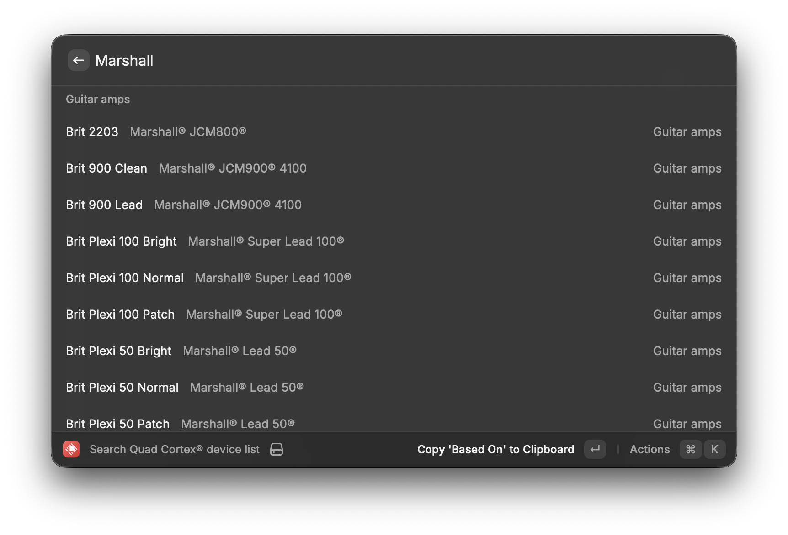

# Quad Cortex® Device List



This is a Raycast extension to search the Neural DSP® Quad Cortex® device list found at https://neuraldsp.com/device-list.

If you're like me you often find yourself wanting to know more about a specific device. Instead of opening the device list page and searching, this extension allows you to search the device list by name, category, or based on, and quickly copy the based on name to your clipboard. It also allows you to view the Quad Cortex® manual and the Cortex Control™ manual.

## Updating the Device List

To update the device list, run:

```bash
npm run scrape-devices
```

This will scrape the latest devices from the Neural DSP® device list page and update `lib/devices.json`.

## Trademark Acknowledgment

Neural DSP®, Quad Cortex®, and related trademarks are registered trademarks of Neural DSP Technologies Oy. This extension is not affiliated with, endorsed by, or sponsored by Neural DSP Technologies Oy.